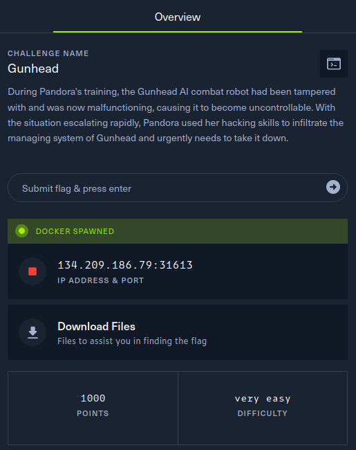
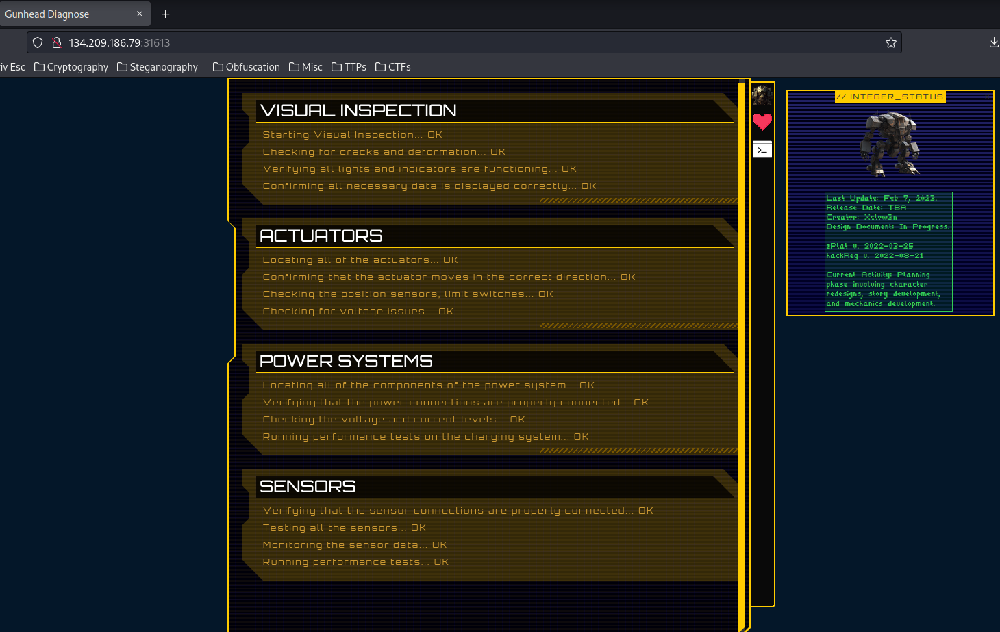
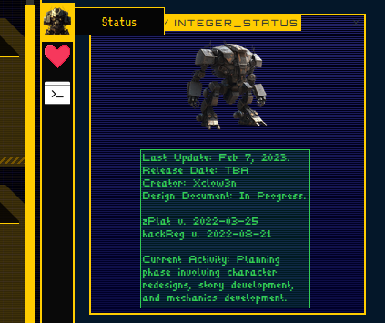
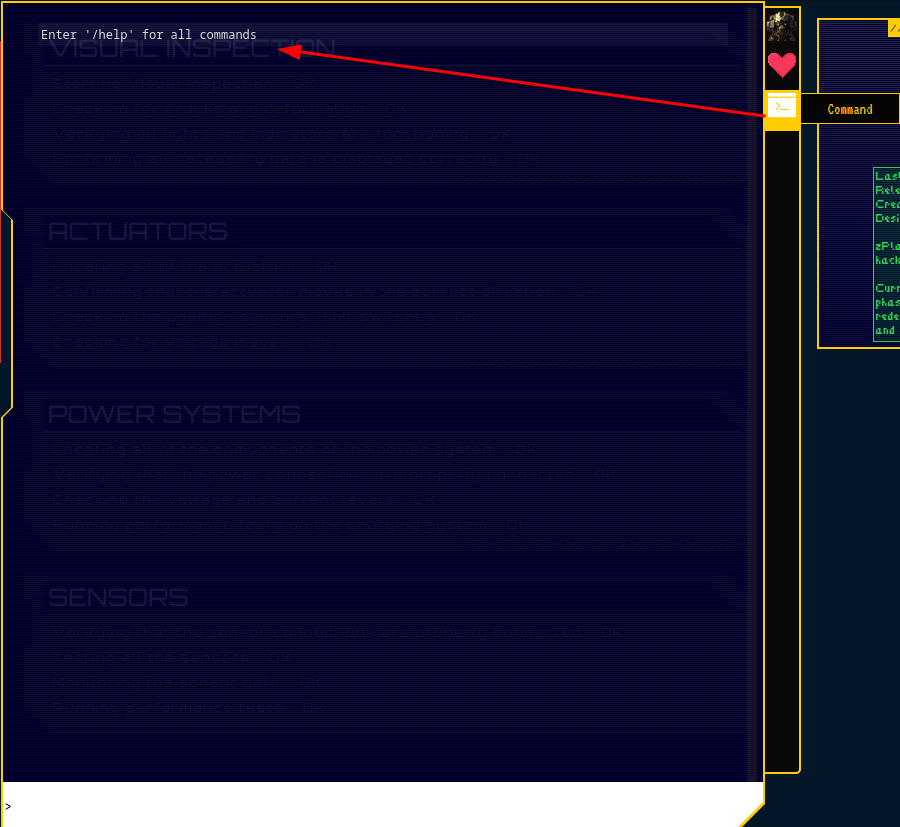
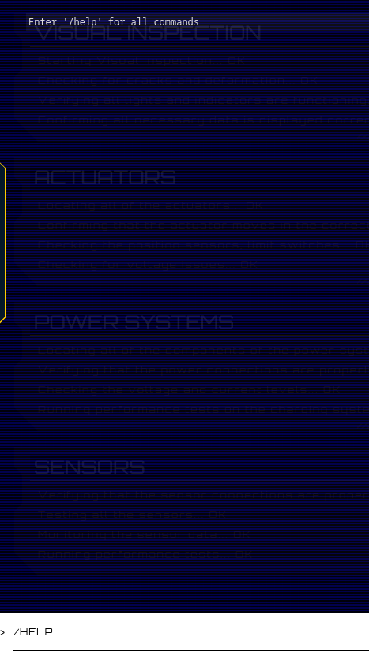
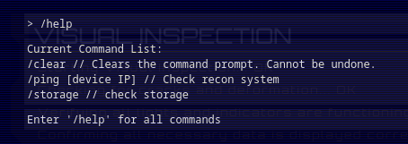
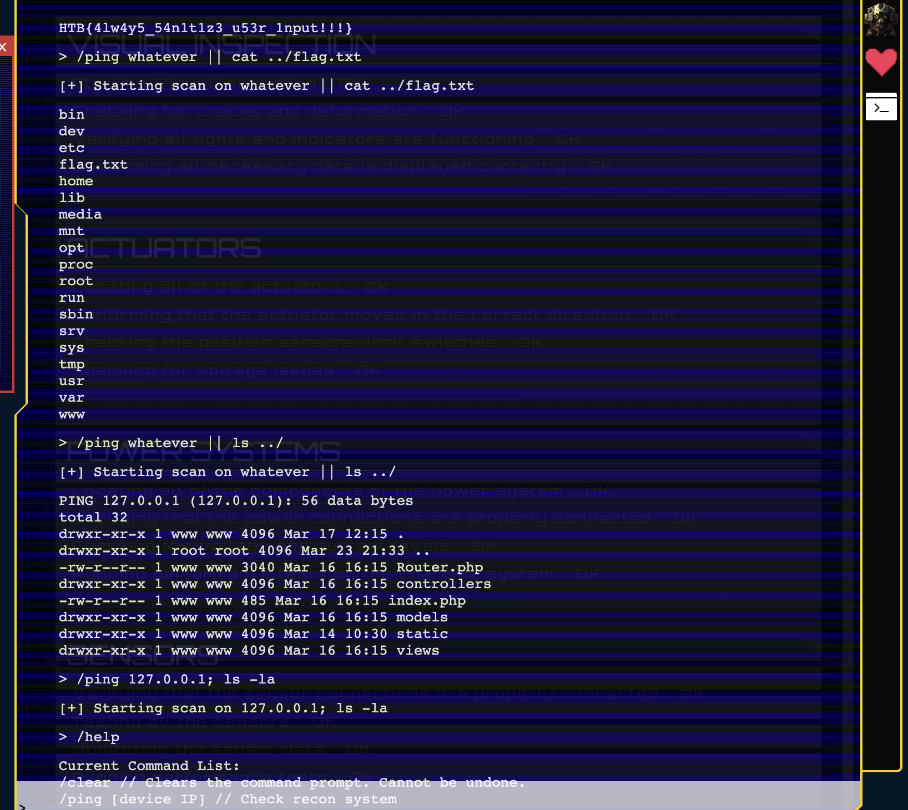

# Gunhead

During Pandora’s training, the Gunhead AI combat robot had been tampered with and was now malfunctioning, causing it to become uncontrollable. With the situation escalating rapidly, Pandora used her hacking skills to infiltrate the managing system of Gunhead and urgently needs to take it down.



In the above picture you can see the description of the challenge, the IP-address, port and files which assist you in solving the challenge.
Given that it is a web challenge we can just put http://134.209.186.79:31613 into the browser's address bar and access the web application. 


## Enumeration

1. ### View Page source

The very first thing i do when dealing with web apps is to vie the source code of the page with simply righ clicking with the mouse on View Page Source or Inspect. Sometimes the developer forgets to remove the comments from which we could gain valueable information.

2. ### Play around with the app
   
Looking at the homepage we can see some information and status about the robot.



by klicking on the Status icon we can see




So nothing interesting so far.

What we are looking for is something to interact with the application, let's look further.
Speaking of the devil the 3rd icon looks like a command line icon. Let's click on it.



Reading the command line output we first get a message that we can issue a /help command.
But before we start poking around lets not just play around with no intention. Let's think what we have got so far for feeding our attacker brain. We have an web application with a functionality to open a command line where we can issue commands. What pops up in my mind first is that it could be a kind of injection attack. So lets see what commands we can issue into the terminal.




 
By typing /help we get 3 options. /clear /ping /storage. Trying the /storage command it just displays us some storage information. But looking at the /ping command we see that it also provides the parameter [device ip] as a user input. Means we can send a command to the system. The ping command is in both Windows and Linux a built-in command line function to send icmp packets to a network host. So it's clear that its triggering an instruction to the operating system. Can we exploit that ? Maybe by looking into the files which we could download initially we get some insights.

3. ### Examining the source code
   
After opening the downloaded files it seems like we have the whole source code of the web app. 
```shell
.
|--- web_gunhead
      |---  challenge
            |--- controllers
                   |--- ReconController.php
            |--- models
                   |--- ReconModel.php
            |--- static
            |--- views
            |--- index.php
            |--- Router.php
      |--- config
      |--- build-docker.sh
      |--- Dockerfile
      |--- flag.txt 
```
Like a cat seeing a mouse i immediately look at the flag.txt's content but unfortunately it is just a fake flag for testing. Would have been to easy right.

Given all the information we have to our attacker mindset we try to look for the file for user inputs and the ping command. That file is `ReconModel.php`. Let's have a look.

```php

<?php
#[AllowDynamicProperties]

class ReconModel
{   
    public function __construct($ip)
    {
        $this->ip = $ip;
    }

    public function getOutput()
    {
        # Do I need to sanitize user input before passing it to shell_exec?
        return shell_exec('ping -c 3 '.$this->ip);
    }
}

```

Tada ! There is a sweet hint masked as a comment where the developer doesn't know if he should check the user input before passing it to the `shell_exec`. This command opens a shell on the underlying operating system and executes the command `ping -c 3` with the ip address entered by the user of the program. The `-c 3` option tells it to send 3 icmp requests.

Seems like we got a nasty OS command injection vulnerability which leads to Remote Code Execution. Due to lack of input validation this vulnerability can be exploited.

OS command injection (also known as shell injection) is basically a web security vulnerability that allows an attacker to execute arbitrary operating system (OS) commands on the server that is running an application.

4. ### Exploit

Given that let's try a command injection.



Here we make use of the semicolon symbol. By sending `/ping 127.0.0.1; ls -al` and placing a semicolon after the IP-Address the shell first executes the icmp request and steps right to the "next instruction line" which typically comes after a semicolon. It worked ! That means it is a Linux file system and the result then lists us all files and also hidden files in the current working directory with `ls -al`. Now we have to search a little bit. Moving one directory back which also seems to be the root directory, we can find a lovely sequence of characters named `flag.txt`.
There are multiple ways of implementing command injections. This technique makes use of chaining commands using the semicolon to chain the `ping` and `ls -al` command. If you want to explore other commands https://github.com/swisskyrepo/PayloadsAllTheThings/tree/master/Command%20Injection is a great source for that.

Now in the final step we just have to display the `flag.txt`'s contents. Armoured with our knowledge we again chain commands together but now using the `||` operator. As mentioned there are different techniques and this one executes the `ls -al` command because we didn't provide a correct parameter which should be an IP-Address. So the the command on the left side of the `||` operator fails and it jumps to the right side of the operator resulting in executing `ls -al`. This is a simple boolean logic expression where `ping` results in `False` and `ls -al` in `True`. 

Finally we issue the `cat` command to display the contents of the Flag. Congrats ! We took down the robot's management system and stopped the AI combat robot from causing more damage.


