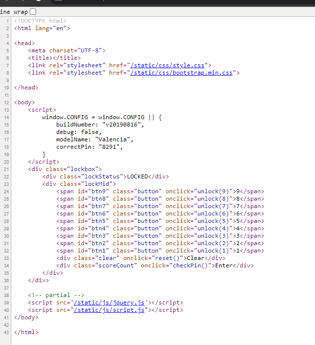
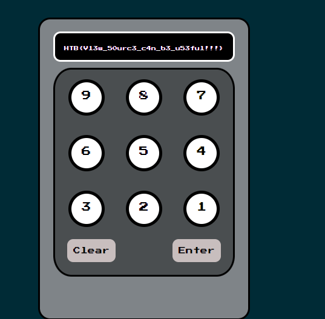

# Trapped Source

### Challenge

Intergalactic Ministry of Spies tested Pandora’s movement and intelligence abilities. She found herself locked in a room with no apparent means of escape. Her task was to unlock the door and make her way out. Can you help her in opening the door?

## Enumeration

### View Page source
The very first thing i do when dealing with web apps is to view the HTML source code of the page with simply right clicking with the mouse on View Page Source or Inspect. Sometimes the developer forgets to remove the comments from which we could gain valuable information.

Oh wow that was an easy one ! Sometimes even the title of the challenge can guide you in the right direction. Trapped *Source*

As i mentioned it's always goog practice to look at the HTML source code first.
As we can see there is an embedded JavaScript script with an object which has the PIN to unlock. `correctPin: "8291"`.

After typing in the found number we unlock the door and liberate Pandora !